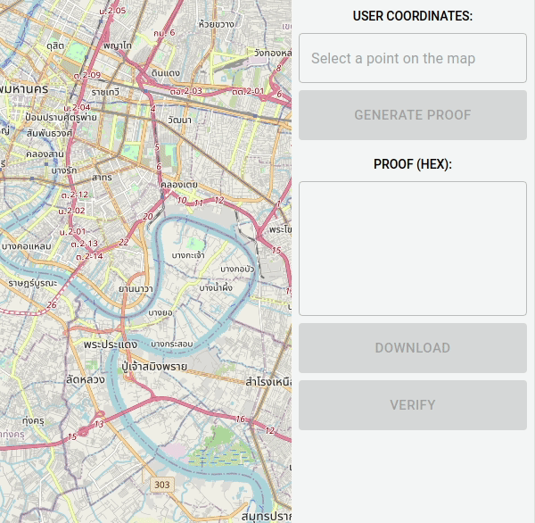

# Privacy-aware Covid-19 tracker

The idea is to protect the users' privacy while proving that person didn't appear in a dangerous area.

> They who can give up essential liberty to obtain a little temporary safety deserve neither liberty nor safety. - Benjamin Franklin


The privacy is important. Let's care about privacy and allow authority instances (like Governance) to ensure that a person wasn't appeared in the COVID-19 affected area by generation proof that proves the User is outside the specified area. So Governance can control the spreading of a virus without tracking the exact location of all Users.


**This article and attached repo contain a proof of concept project made for the TON contest: **

[#18 Groth16 zkSNARK Proof Verification Use Cases](https://devex.gov.freeton.org/proposal?proposalAddress=0%3Ae6b65075478e7d412fdb0870452f30dfa8bf51272e28a3167abc5c5df6fd051d)


## Idea

**The idea is to prove that you weren't in some specific area on the map without revealing your actual location.**

To do so, we made a prototype by creating a zkSNARK widget that accepts Users' coordinates (as personal input) and generates proof that this is outside of a specified area defined by `min` and `max` coordinates (as auxiliary input).

## Demonstration



## Workflow

##### Initial setup:

1. **Governance** create a solidity contract with snark that can validate coordinates and get the answer, is the User placed in the specified area
2. **User** generates proof on his device and send it to the contract

##### After this:

1.  User can  confirm that he is in a safe area
2.  User location data doesn't send outside of his device, so we preserve privacy

## Assumptions

1. Let's assume that each user have unique secure device which generates proof with current coordinates as an input (which is never leave this device). In the demo we made a server that emulates this device.

2. Personal ID and Time assumption: In real world we have to provide secure device, that encrypt location on the user's side and they have to be bonded with location. So let's assume that a personal tracker can log it.

## Implementation:

A zkSNARK checks that at least one of these constraints is true, using a _comparison_ components from a blueprint library:

```
userLatitude <= minLatitude
maxLatitude <= userLatitude
userLongtitude <= minLongtitude
maxLongtitude <= userLongtitude
```

## Architecture:

### ZKP (blueprint)

By running the script, you can
Do trusted setup: Generate `proving.key` & `verification.key`
Generate and  save `proof` and `primary_input` to file by given coordinates and min/max coordinates
Verify example (Check the status of the proof)

### TON Blockchain (smart contract)

Validates proof on-chain using VERGRTH16 TVM instruction.

### Demo web app

This web application interactively generates and validates proofs for a given user location and restricted area coordinates.
* Proofs are generating by a node backend with compiled blueprint CLI tool and pre-generated proving key;
* Proofs are validating on chain using `verification.sol` smart contract from a repo, deployed at:
`0:e13752c9dc987ca1e33a012511409b273ea06af68e799c24f3cee861fc9815aa`

address at Nil's test network;

* A verification key is stored in the smart contract and can be changed using the `setVerificationKey` method

## How to build and use:

### ZKP CLI tool

1. Clone:
```
git clone  https://github.com/idealatom/ton-zkp-contest --recursive
```

2. Go to build directory:
```
cd ton-zkp-contest/zkp && mkdir build && cd build
```

3. Build
```
cmake .. && make cli
```

4. Generate proving and verification keys:
```
> bin/cli setup
Blueprint size: 284
Generating constraint system...
Number of R1CS constraints: 287
Generating key pair...
Saving proving key to a file "proving.key"
Saving verification key to a file "verification.key"
```

5. Generate the proof for given coordinates:
```
> bin/cli prove --posLat 13.686019 --minLat 13.673677 --maxLat 13.697777 --posLng 100.564981 --minLng 100.523192 --maxLng 100.551189
Loading proving key from a file "proving.key"
Generating constraint system...
Generating witness...
Blueprint is satisfied: 1
Generating proof...
Saving proof to file "proof"
Saving primary input to file "primary.input"
```

6. Verify proof file using saved primary input and verification key:
```
> bin/cli verify
Loading proof from a file "proof"
Loading primary input from a file "verification.key"
Loading verification key from a file "primary.input"
Verification status: 1
```

### Web app backend

```
cd ./backend

npm install

npm run dev

```

### Web app frontend

```
> cd /frontend/
> yarn install
> yarn start
```

Then open `localhost:8000` in your browser.


## Testing

Build tests:
```
> cd /zkp/test/
> cmake .. -DBUILD_TESTS=1
> make circuit_test
```
Run tests
```
> test/circuit_test
```
